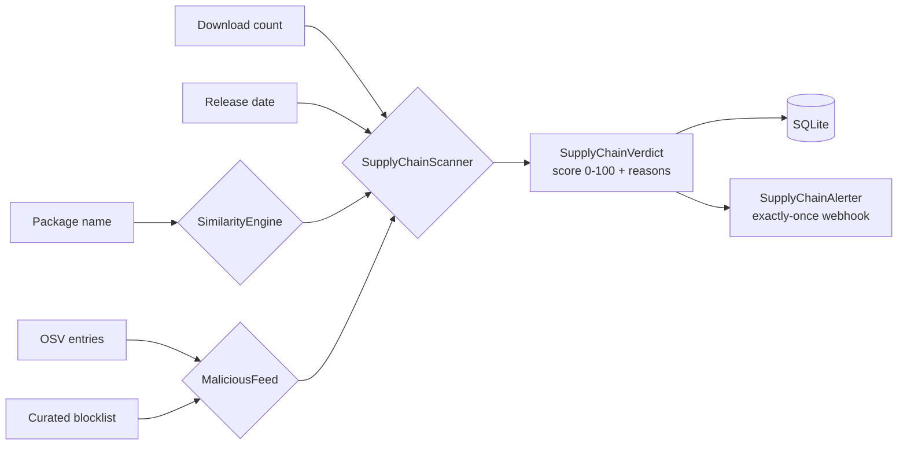

# Supply-Chain Attack Detection

PythonDepot detects **typosquatting** and **malicious-package** risk for PyPI package names. It combines name-similarity heuristics (Levenshtein / Damerau-Levenshtein edit distance plus prefix/suffix matching), known-malicious feed data (OSV entries + an optional curated blocklist), download-count signals, and release-freshness signals into a single 0-100 risk score with human-readable reasons. Verdicts are persisted to SQLite and can trigger exactly-once webhook alerts.



---

## Modules

### SimilarityEngine

`python_depot.supply_chain.SimilarityEngine`

Name-similarity heuristics for typosquatting detection. Combines edit distance with prefix/suffix heuristics into a normalized similarity score in `[0.0, 1.0]`; a candidate is considered a typosquat when its score against a known name meets the configurable `threshold` (default `0.8`).

| Method | Description | Returns |
|--------|-------------|---------|
| `levenshtein_distance(a, b)` | Classic Levenshtein edit distance | `int` |
| `damerau_levenshtein_distance(a, b)` | Optimal-string-alignment distance incl. adjacent transpositions | `int` |
| `prefix_similarity(a, b)` | Shared-prefix fraction of the longer name | `float` |
| `suffix_similarity(a, b)` | Shared-suffix fraction of the longer name | `float` |
| `similarity(a, b)` | Combined score — max of edit-distance similarity, prefix and suffix similarity | `float` |
| `is_similar(candidate, known)` | `True` when `similarity(candidate, known) >= threshold` | `bool` |

Taking the strongest signal means a candidate that shares a long prefix or suffix with a known name is flagged even when the raw edit distance is relatively large (e.g. `request` vs `request-toolkit`).

### PackageInfo

`python_depot.supply_chain.PackageInfo` — dataclass with metadata used by the download/freshness heuristics.

| Field | Type | Default | Description |
|-------|------|---------|-------------|
| `name` | `str` | — | Package name |
| `downloads` | `int` | `0` | Lifetime download count (0 when unknown) |
| `released_at` | `datetime \| None` | `None` | First release / publish timestamp (None when unknown) |

### MaliciousFeed

`python_depot.supply_chain.MaliciousFeed`

Loads known-bad package names from OSV entries plus an optional curated blocklist. Entries are used both to flag known-malicious names directly and as the `known` corpus for typosquatting comparison. `load` populates state from the configured sources; `refresh` re-fetches it so a fresh scan sees updated feed data.

| Method | Description |
|--------|-------------|
| `load()` | Load feed data from OSV entries + blocklist |
| `refresh()` | Re-load feed data (called automatically on each scan) |
| `is_known_malicious(name)` | `True` when `name` appears in the OSV/blocklist data |
| `known_packages()` | Sorted list of known-malicious names |

### SupplyChainScanner

`python_depot.supply_chain.SupplyChainScanner`

Combines all signals into an integer 0-100 risk score with a list of human-readable reasons. Low download counts, recent publication, and name similarity to a known/popular package all raise the score.

| Method | Description |
|--------|-------------|
| `scan(package, info=None)` | Scan one package → `SupplyChainVerdict` |
| `scan_many(packages)` | Scan a list of packages → `list[SupplyChainVerdict]` |
| `download_risk(downloads)` | `[0.0, 1.0]` risk contribution; fewer downloads → higher risk |
| `freshness_risk(released_at)` | `[0.0, 1.0]` risk contribution; releases younger than `max_release_age_days` get full risk, decaying linearly to 0 over the following year |

Constructor defaults: `threshold=0.8`, `min_downloads=1000`, `max_release_age_days=30`.

The comparison corpus is the feed's known-malicious names plus the `POPULAR_PACKAGES` list (top-20 popular PyPI names such as `requests`, `numpy`, `django`, `flask`). The package itself is always excluded from its own comparison.

### SupplyChainVerdict

`python_depot.models.supply_chain_verdict.SupplyChainVerdict` — SQLAlchemy model persisted to the `supply_chain_verdicts` table.

| Column | Type | Description |
|--------|------|-------------|
| `package` | `String(200)` | Scanned package name (indexed) |
| `score` | `Integer` | Risk score 0-100 |
| `reasons` | `Text` | JSON-encoded list of detection reasons |
| `detected_at` | `DateTime` | UTC timestamp (indexed) |

### SupplyChainAlerter

`python_depot.supply_chain.SupplyChainAlerter`

Fires webhook notifications for newly detected suspicious packages with **exactly-once** semantics: a package that was already notified never triggers a second notification.

**Webhook payload** (POST `application/json`):

```json
{
  "event": "supply_chain_alert",
  "package": "requets",
  "score": 85,
  "reasons": ["name is similar to known package 'requests'"],
  "timestamp": "2026-08-03T12:10:00.000000+00:00"
}
```

Webhook delivery requires a `webhook_url`; without one the alerter logs a warning and skips delivery.

### store_verdict / list_verdicts

`python_depot.supply_chain.store_verdict(db, verdict)` persists a verdict (insert or update by package); `list_verdicts(db)` returns stored verdicts, most recent first.

---

## Risk score semantics (0-100)

The score is an integer in `0-100`; **higher = more suspicious**. Contributions are summed and capped at 100 (rounded):

| Signal | Max contribution | Reason string |
|--------|------------------|---------------|
| Known-malicious membership (OSV / blocklist) | +60 | `package is listed as known-malicious` |
| Name similarity to a known/popular package (≥ 0.8) | +20 | `name is similar to known package '<name>'` |
| Low download count (`download_risk` > 0.5) | +15 | `low download count (<N>)` |
| Recently published (`freshness_risk` > 0.5) | +15 | `recently published` |

Verdicts with `score >= 60` are considered **suspicious** and trigger an alert attempt on scan (`SUSPICIOUS_SCORE` in `python_depot/routers/supply_chain.py`).

---

## REST API

| Method | Path | Description |
|--------|------|-------------|
| GET | `/api/v1/supply-chain/check` | Typosquatting verdict for a single package |
| GET | `/api/v1/supply-chain/scan` | Verdicts for the dependency set (20 popular packages) |

### GET `/api/v1/supply-chain/check`

Returns a typosquatting verdict for a single package. Persists the verdict to SQLite.

**Query Parameters:**

| Param | Type | Required | Description |
|-------|------|----------|-------------|
| `package` | string | yes | Package name to scan |

**Example request:**

```bash
curl "http://localhost:8000/api/v1/supply-chain/check?package=requets"
```

**Example response** (a candidate similar to `requests` with unknown download data):

```json
{
  "package": "requets",
  "score": 35,
  "reasons": [
    "name is similar to known package 'requests'",
    "low download count (0)"
  ]
}
```

**Response fields:**

| Field | Type | Description |
|-------|------|-------------|
| `package` | string | The scanned package name |
| `score` | int | Risk score 0-100 (higher = more suspicious) |
| `reasons` | array of strings | Human-readable detection reasons (empty when score is 0) |

**Errors:**

- `422 Unprocessable Entity` — `package` query parameter missing or invalid.

A benign, well-known package with no negative signals scores low:

```json
{
  "package": "requests",
  "score": 15,
  "reasons": [
    "low download count (0)"
  ]
}
```

> Note: without PyPI metadata, download counts default to 0, so the download heuristic contributes `low download count (0)` even for popular names. The scanner accepts a `PackageInfo` with real `downloads` / `released_at` data programmatically for richer scoring.

### GET `/api/v1/supply-chain/scan`

Scans the dependency set (the 20-package `POPULAR_PACKAGES` corpus) and returns one verdict per package. Each verdict is persisted; verdicts with `score >= 60` additionally trigger a `SupplyChainAlerter` notification.

**Example request:**

```bash
curl "http://localhost:8000/api/v1/supply-chain/scan"
```

**Example response** (truncated to 2 of 20 verdicts):

```json
{
  "verdicts": [
    {
      "package": "requests",
      "score": 15,
      "reasons": ["low download count (0)"]
    },
    {
      "package": "numpy",
      "score": 15,
      "reasons": ["low download count (0)"]
    }
  ],
  "scanned_at": "2026-08-03T12:09:33.397365+00:00"
}
```

**Response fields:**

| Field | Type | Description |
|-------|------|-------------|
| `verdicts` | array of objects | One verdict per scanned package, each with `package`, `score`, `reasons` |
| `scanned_at` | string | ISO-8601 timestamp of the scan |

---

## Shell Usage

```bash
# Single package verdict
curl "http://localhost:8000/api/v1/supply-chain/check?package=requets"

# Full dependency-set scan
curl "http://localhost:8000/api/v1/supply-chain/scan"
```

---

## Configuration

| Setting | Location | Default | Description |
|---------|----------|---------|-------------|
| `SUSPICIOUS_SCORE` | `python_depot/routers/supply_chain.py` | `60` | Verdicts at or above this score trigger an alert attempt on scan |
| Similarity `threshold` | `SupplyChainScanner(threshold=...)` | `0.8` | Minimum similarity for a typosquat match |
| `min_downloads` | `SupplyChainScanner(min_downloads=...)` | `1000` | Downloads below this raise risk |
| `max_release_age_days` | `SupplyChainScanner(max_release_age_days=...)` | `30` | Releases younger than this raise risk |
| Webhook URL | `SupplyChainAlerter(webhook_url=...)` | unset | Without a URL, alert delivery is skipped (logged) |
